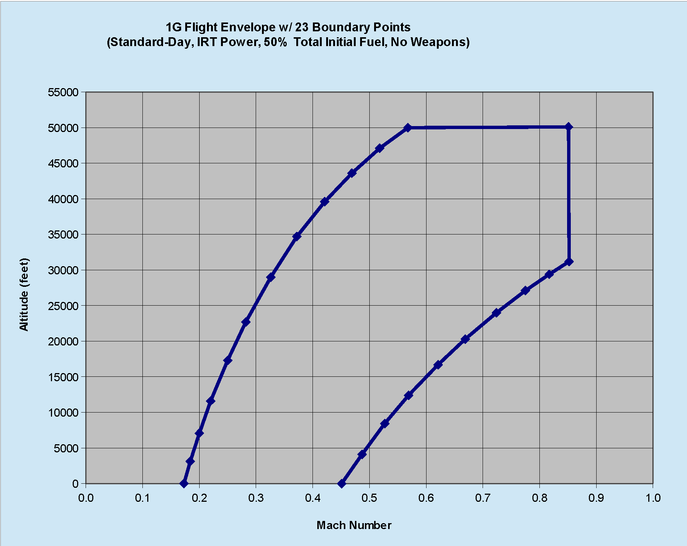
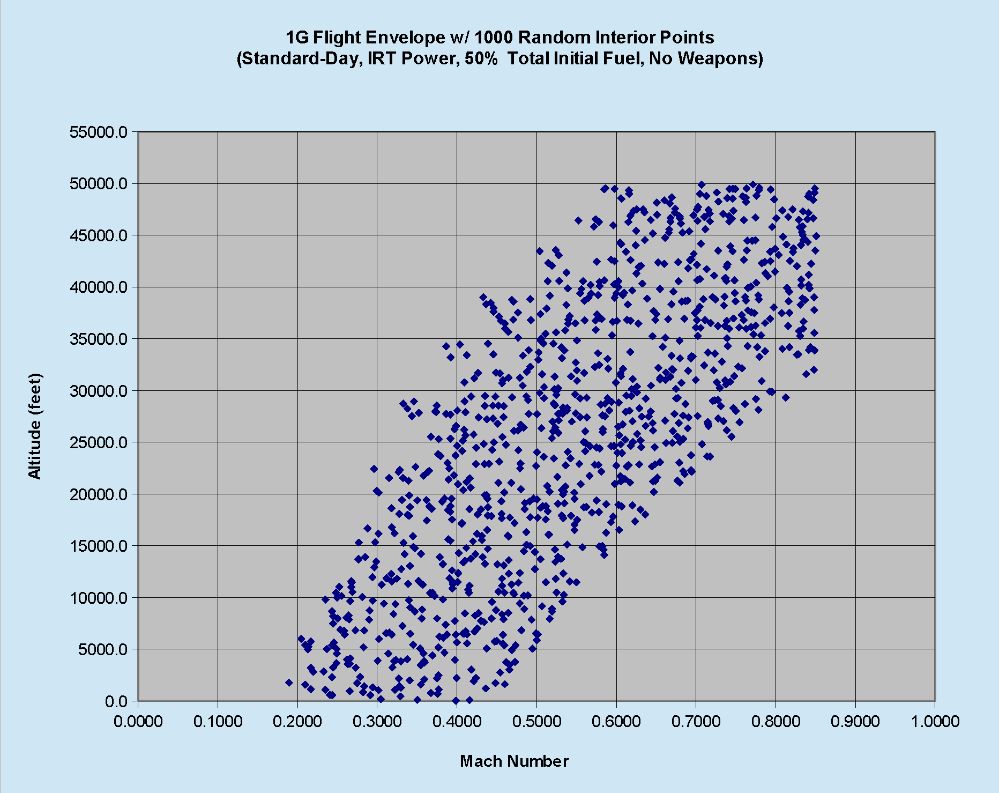
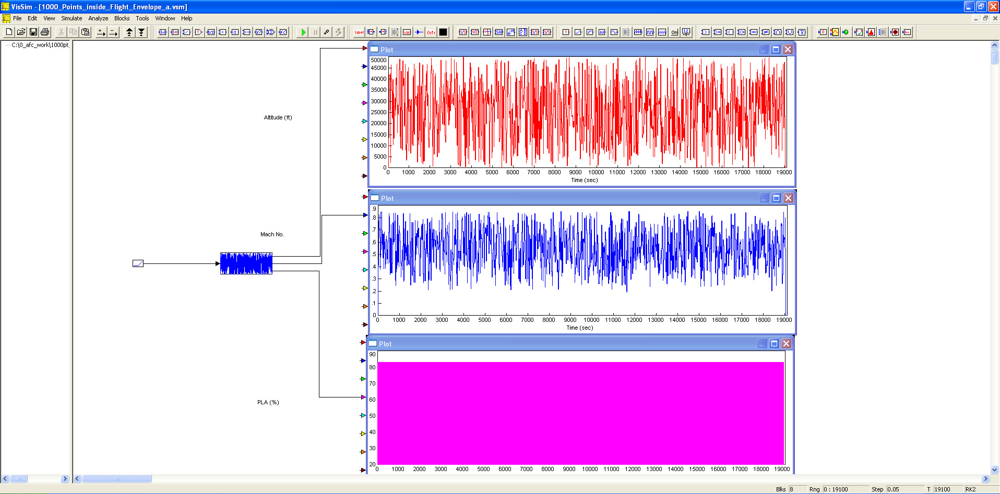

# ========================================
# 1000 Point Random Test Flight Profile Within Flight Envelope:
# ========================================

## A (1000) point random Flight Profile is created consisting of Altitude/Mach No./Engine-PLA(%) triples, all within the existing Flight Envelope. The purpose was to support various AV simulation requirements using VISSIM

##
## I. Operation: 
### Ia. FORTRAN Executable: "./bin/1000pt_FP.exe"
### Ib. 1000 Point Random Test Flight Profile Test Case: "./VISSIM/1000_Points_inside_Flight_Envelope_a.vsm"

##
## II. Existing Flight Envelope:

##
## III. (1000) Point Random Flight Profile Within Existing Flight Envelope:

##
## IV. (1000) Point Random Flight Profile Within Existing Flight Envelope Test Top Level Diagram:

## V. Output:
### Va. "./output/output.dat"
### Vb. "./output/output_actual.dat"
### Vc. "./output/output_actual.map"
## 
## *Note: 
## 1. Performance Data and Analysis performed using VISSIM, ( https://web.solidthinking.com/vissim-is-now-solidthinking-embed )

